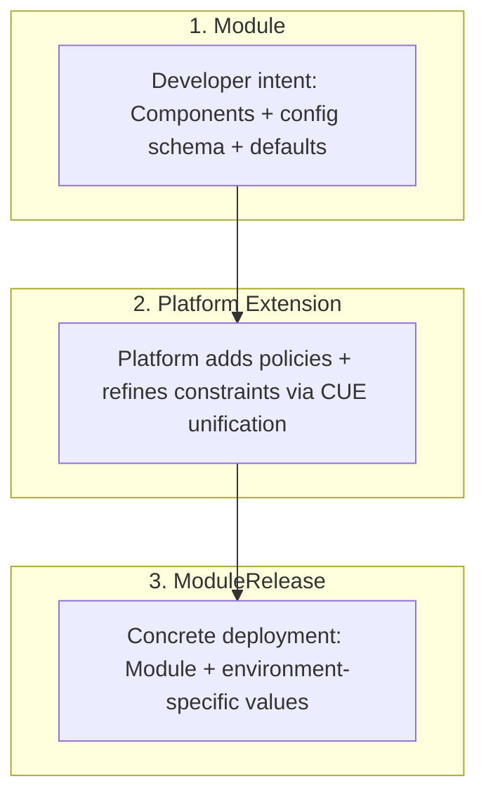

# OPM Core

**⚠️ This project is under heavy development. APIs and schemas may change.**

## Why

OPM provides a type-safe, portable application model that separates developer intent from platform implementation. CUE's structural typing catches configuration errors at definition time, not in production. Platform teams encode governance through composable policies. Developers describe what should run without coupling to a specific runtime.

The result: portable intent + governed runtime.

## Definition Types

OPM organizes types into **Primitives** (schema contracts for what exists, how it behaves, and what rules apply) and **Constructs** (framework types that compose, deploy, and render).

| Type | Family | Question It Answers | Level |
|------|--------|---------------------|-------|
| **Resource** | Primitive | "What must exist?" | Component |
| **Trait** | Primitive | "How does it behave?" | Component |
| **Blueprint** | Primitive | "What is the reusable pattern?" | Component |
| **PolicyRule** | Primitive | "What must be true?" | Policy |
| **Component** | Construct | "What composes primitives?" | Module |
| **Module** | Construct | "What is the application?" | Top-level |
| **ModuleRelease** | Construct | "What is being deployed?" | Deployment |
| **Policy** | Construct | "What policy rules apply where?" | Module |
| **Provider** | Construct | "What platform is targeted?" | Rendering |
| **Transformer** | Construct | "How are components rendered?" | Rendering |

For detailed definitions, see:

- [Definition Types](docs/core/definition-types.md) — Primitives vs Constructs taxonomy
- [Primitives](docs/core/primitives.md) — Resource, Trait, Blueprint, PolicyRule
- [Constructs](docs/core/constructs.md) — Component, Module, ModuleRelease, Policy, Provider, Transformer
- [Glossary](docs/glossary.md) — CUE-specific terms, personas, workflow terms

## How

OPM formalizes the path from intent to deployment through three stages:

**Module** — Defines the application: Components (Resources + Traits or Blueprints), configuration schema (`#config`), and sane defaults (`values`). Module Authors publish these to a registry.

**Platform Extension** — Platform teams extend Modules via CUE unification to add governance (Policies), tighten constraints, or add cross-cutting concerns without forking.

**ModuleRelease** — End-users or deployment systems bind a Module to concrete values for a target environment. CUE validates the values against the Module's `#config` at definition time.

The separation between schema (`#config`) and defaults (`values`) is key: Module Authors define the contract, Platform teams refine it, End-users provide environment-specific values. CUE's unification ensures all layers compose correctly or fail early.

## Further Reading

- [docs/core/](docs/core/) — Complete definition type reference
- [docs/glossary.md](docs/glossary.md) — Personas, CUE terms, workflow concepts
