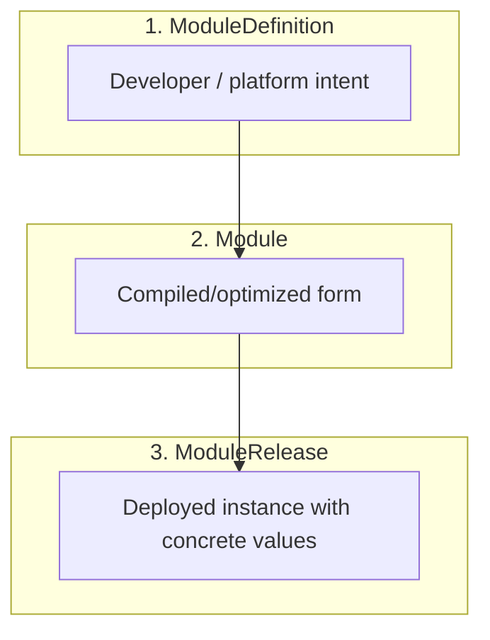

# OPM Core

## Definition Types

In OPM, everything is a **Definition**.

Each Definition type has a clear job. Together they describe what should run, how it should behave, how it's governed, and how it's delivered.

### Resource

A Resource is the fundamental building block inside a Component. It describes "the thing that actually exists."

A Component must include at least one Resource.

A Resource can represent:

* a workload (`#Container`)
* persistent state / storage (`#Volume`)
* runtime configuration (`#ConfigMap`, `#Secret`)
* other platform-relevant primitives (like network rules)

Examples:

* `#Container` – describes a single container that represents the workload for this Component.
* `#Volume` – describes one or more persistent volumes.
* `#ConfigMap`, `#Secret` – configuration and sensitive inputs.

You can declare multiple Resources in the same Component (for example: one container plus multiple volumes). At least one is required so the Component is about something real.

### Trait

A Trait is an optional behavior and property modifier that applies to a Component.

Traits adjust how a Component runs, scales, exposes itself, and reports health. Traits may relate to specific Resources via `parentResources`, but they modify the Component's overall behavior, not individual Resources.

Examples:

* scaling / replicas
* ingress / exposure rules
* health / readiness / liveness checks
* TLS / transport security posture

You can attach multiple Traits to the same Component. Defaults exist so you don't have to specify every Trait every time.

In plain terms: Resources are "what exists," Traits are "how the Component behaves."

### Blueprint

A Blueprint is a reusable, higher-level definition that bundles Resources and Traits into something humans actually want to deploy.

Blueprints exist so most developers don't have to wire Resources and Traits manually.

Examples:

* `WebService` – a typical stateless HTTP service with container, replicas, health checks, and network exposure already defined.
* `StatefulService` – a stateful workload with container + volume + backup/retention expectations.

Blueprints can be composed from other Blueprints. Platform teams can publish a set of blessed Blueprints as "golden paths" for internal use.

### Component

A Component is what an application developer (or platform engineer acting as an application developer) actually declares in a module.

A Component can be:

* one or more Resources plus Traits, or
* a Blueprint, which already packages Resources + Traits.

In other words: the Component is the "piece of the app" you're describing.

### Policy

A Policy captures governance, security posture, compliance requirements, residency rules, and other non-negotiables.

Policies are how platform and security teams encode rules like:

* containers must run as non-root
* data for this component must remain in a specific region
* traffic must be TLS-only with approved ciphers
* audit logging and retention must meet regulatory requirements

Policies are enforced, not optional.

### Scope

A Scope defines where and how Policies apply.

Scopes let you attach Policies across Components. Scopes can:

* apply baseline security to every Component in a module
* describe which Components are allowed to communicate with which other Components
* describe shared configuration / shared secrets exposure between Components

Both platform teams and module developers can define Scopes:

* **Platform teams** define Scopes for baseline security, compliance, and resource governance.
* **Module developers** define Scopes for application-level concerns like connectivity and operational behavior.

When platform teams extend a ModuleDefinition via CUE unification, their Scopes are added alongside developer-defined Scopes. CUE's unification semantics ensure that once a Scope is added, it becomes part of the module.

### Lifecycle (planned)

A Lifecycle Definition describes how something changes over time, not just what it looks like at rest.

This includes:

* deployment / rollout strategy
* upgrade sequencing
* backup + restore steps for stateful workloads
* pre-deploy and post-deploy hooks
* safe teardown or migration

Lifecycle Definition is intentionally called out but treated as "future." The goal is to eventually express upgrade/rollback behavior and compliance-critical steps ("backup before upgrade") in the model itself, instead of burying that logic in CI/CD glue.

---

## Components

A **Component** belongs to a ModuleDefinition. It represents one logical part of an application.

A Component is made from:

* one or more Resources (required),
* optional Traits that modify the Component's behavior,
* or a Blueprint (which already bundles Resources and Traits).

There are two broad categories of Components:

### Workload Components

* Stateless: horizontally scalable service
* Stateful: service with persistent data
* Daemon: node-scoped service
* Task: run-to-completion job
* ScheduledTask: recurring / cron-like job

### Resource Components

* Shared or supporting resources like `ConfigMap`, `Secret`, `Volume`, etc., which other Components consume.

This split makes it clear what is "a running thing" vs "infrastructure/config backing that thing."

---

## Scopes and Policy

Scopes and Policy are how you get governance without killing portability.

* A **Policy** encodes the rule: security, residency, compliance, org standard.
* A **Scope** attaches that Policy to one or more Components, and can also define how those Components are allowed to relate (who can talk to who, who can consume whose secret, etc.).

Platform teams can:

* define Scopes for baseline security and compliance posture,
* extend ModuleDefinitions via CUE unification to add governance.

Developers can:

* operate inside those Scopes,
* inherit required Policies automatically,
* avoid reimplementing org rules in each service.

The result is portable intent + governed runtime.

---

## Delivery Flow

OPM formalizes how something goes from "what I want" to "what actually runs." The flow is expressed in three main objects:



### ModuleDefinition

The portable intent. Created by developers and/or platform engineers.

A ModuleDefinition for the developer:

* declares Components,
* wires Resources and Traits (or uses Blueprints),
* defines which values are tunable by the eventual user,
* may already include Scopes.

A ModuleDefinition for the platform team:

* platform Policy is applied,
* Scopes are enforced,
* defaults are locked,
* everything is made ready for consumption.

**Developers** write ModuleDefinitions to describe application intent.

**Platform teams** can inherit and extend upstream ModuleDefinitions via CUE unification, adding additional Components, Scopes, or Policies without rewriting the original definition.

### Module

The compiled and optimized form.

A Module is the flattened result of a ModuleDefinition:

* Blueprints are expanded into their constituent Resources and Traits,
* the structure is optimized for runtime evaluation,
* defaults are resolved,
* everything is ready for binding with concrete values.

A Module may include platform additions (Policies, Scopes, additional Components) if it was created by a platform team extending an upstream ModuleDefinition, but the primary purpose is compilation and optimization.

### ModuleRelease

The concrete deployment instance.

A ModuleRelease:

* references a specific Module,
* supplies final values (image tag, replica count, etc.),
* targets a specific runtime environment.

This is what actually lands on a runtime.

---

## Type Safety with CUE

OPM is expressed in CUE. CUE gives you structural typing, constraints, validation, and safe merging.

That means:

* You can express allowed ranges and formats.
* You can block invalid combinations at definition time.
* You can guarantee that platform policies aren't silently dropped.

Example:

```cue
replicas: uint & >=1 & <=100
image:    string & =~".+:.+"            // must include a tag
memory:   string & =~"^[0-9]+[KMG]i?$"  // k8s-style resource units
```

The point: mistakes get caught before rollout, not in production.
