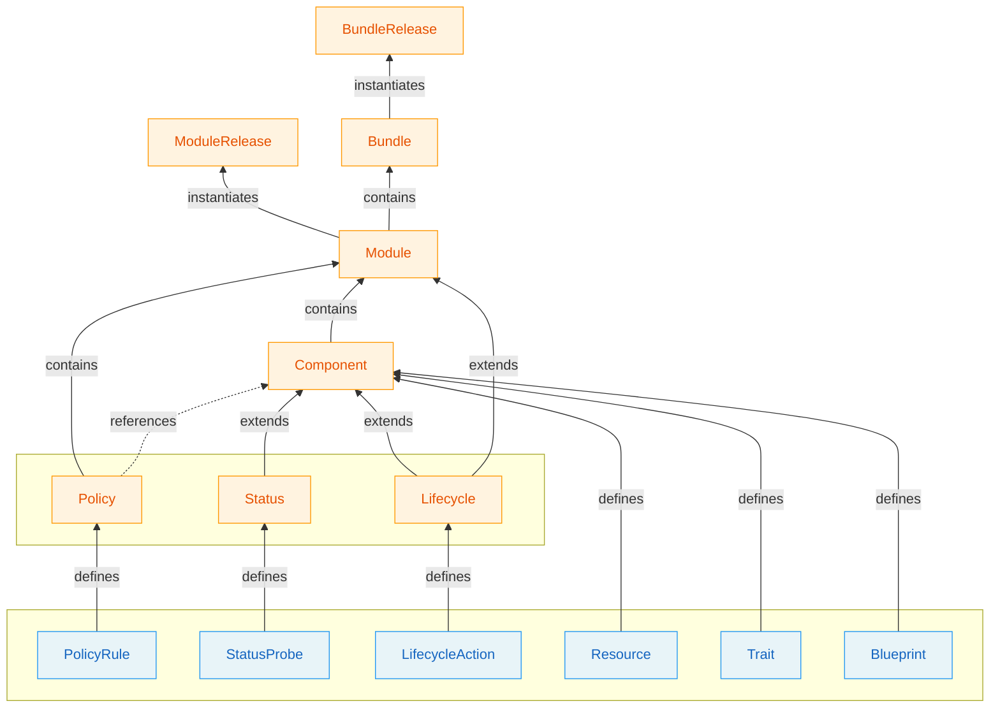

# OPM Definition Types

OPM organizes its types into two families: **Primitives** and **Constructs**.

**Primitives** are schema contracts — independently authored building blocks that define *what* exists, *how* it behaves, and *what rules* apply. They all share the same shape (`metadata` + `#spec`) and are composed into Constructs.

**Constructs** are framework types — they organize, compose, deploy, render, and verify. They consume Primitives but don't define schemas for composition themselves.

### Litmus Test

> Does it define a reusable `#spec` that gets composed?
> **YES** → Primitive | **NO** → Construct

## Summary

| Type | Family | Question It Answers | Level |
|------|--------|---------------------|-------|
| [**Resource**](primitives.md#resource) | Primitive | "What must exist?" | Component |
| [**Trait**](primitives.md#trait) | Primitive | "How does it behave?" | Component |
| [**Blueprint**](primitives.md#blueprint) | Primitive | "What is the reusable pattern?" | Component |
| [**PolicyRule**](primitives.md#policyrule) | Primitive | "What must be true?" | Policy |
| [**StatusProbe**](primitives.md#statusprobe) | Primitive | "What should be checked?" | Module |
| [**LifecycleAction**](primitives.md#lifecycleaction) | Primitive | "What action runs on transitions?" | Component/Module |
| [**Component**](constructs.md#component) | Construct | "What composes primitives?" | Module |
| [**Module**](constructs.md#module) | Construct | "What is the application?" | Top-level |
| [**ModuleRelease**](constructs.md#modulerelease) | Construct | "What is being deployed?" | Deployment |
| [**Policy**](constructs.md#policy) | Construct | "What policy rules apply where?" | Module |
| [**Bundle**](constructs.md#bundle) | Construct | "What modules are grouped?" | Top-level |
| [**BundleRelease**](constructs.md#bundlerelease) | Construct | "What bundle is being deployed?" | Deployment |
| [**Provider**](constructs.md#provider) | Construct | "What platform is targeted?" | Rendering |
| [**Transformer**](constructs.md#transformer) | Construct | "How are components rendered?" | Rendering |
| [**Status**](constructs.md#status) | Construct | "What is the computed state?" | Module |
| [**Lifecycle**](constructs.md#lifecycle) | Construct | "What happens on transitions?" | Component/Module |
| [**Test**](constructs.md#test) | Construct | "Does the lifecycle work?" | Separate artifact |
| [**Config**](constructs.md#config) | Construct | "How is OPM configured?" | Tooling |
| [**Template**](constructs.md#template) | Construct | "How are modules scaffolded?" | Tooling |

## Decision Flowchart

1. **Does it define a reusable `#spec` that gets composed?**
   - Yes → It's a **Primitive**. Continue:
     1. Is this a standalone deployable thing? → **Resource**
     2. Does this modify how a Resource operates? → **Trait**
     3. Is this a reusable composition of Resources/Traits? → **Blueprint**
     4. Is this a constraint with enforcement consequences? → **PolicyRule**
     5. Is this a runtime health/readiness check? → **StatusProbe**
     6. Is this an action that runs during install/upgrade/delete? → **LifecycleAction**
   - No → It's a **Construct**. See [Constructs](constructs.md).
