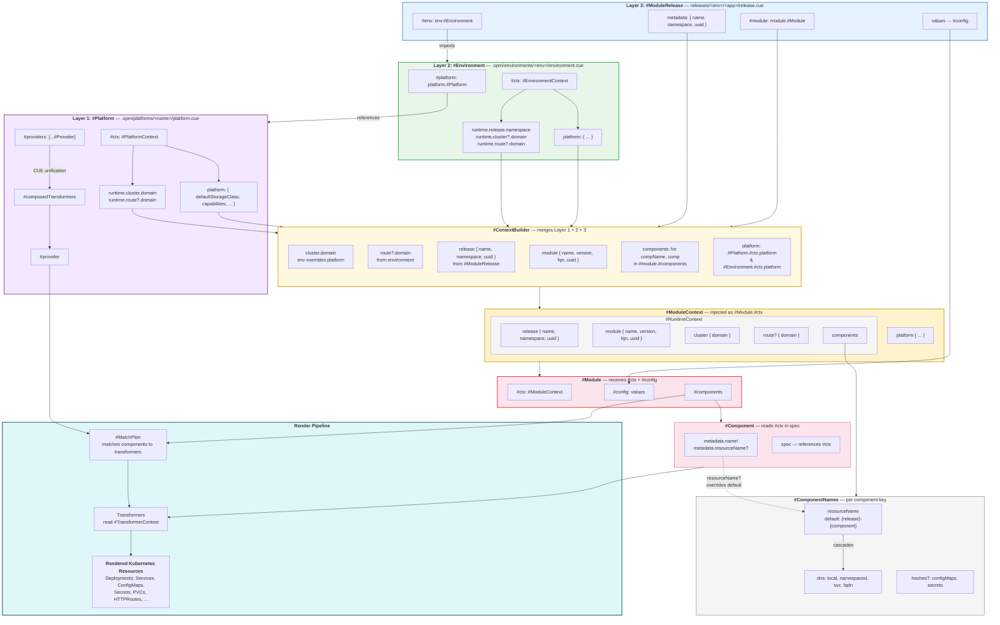

# Context and Information Flow

```mermaid
graph TD
    subgraph L1["<b>Layer 1: #Platform</b> — .opm/platforms/&lt;name&gt;/platform.cue"]
        direction TB
        P_ctx["#ctx: #PlatformContext"]
        P_runtime["runtime.cluster.domain<br/>runtime.route?.domain"]
        P_platform["platform: { defaultStorageClass, capabilities, ... }"]
        P_providers["#providers: [...#Provider]"]
        P_composed["#composedTransformers"]
        P_provider["#provider"]

        P_ctx --> P_runtime
        P_ctx --> P_platform
        P_providers -->|"CUE unification"| P_composed
        P_composed --> P_provider
    end

    subgraph L2["<b>Layer 2: #Environment</b> — .opm/environments/&lt;env&gt;/environment.cue"]
        direction TB
        E_ref["#platform: platform.#Platform"]
        E_ctx["#ctx: #EnvironmentContext"]
        E_runtime["runtime.release.namespace<br/>runtime.cluster?.domain<br/>runtime.route?.domain"]
        E_platform["platform: { ... }"]

        E_ctx --> E_runtime
        E_ctx --> E_platform
    end

    subgraph L3["<b>Layer 3: #ModuleRelease</b> — releases/&lt;env&gt;/&lt;app&gt;/release.cue"]
        direction TB
        MR_env["#env: env.#Environment"]
        MR_meta["metadata: { name, namespace, uuid }"]
        MR_module["#module: module.#Module"]
        MR_values["values → #config"]
    end

    subgraph Builder["<b>#ContextBuilder</b> — merges Layer 1 + 2 + 3"]
        direction TB
        B_cluster["cluster.domain<br/>env overrides platform"]
        B_route["route?.domain<br/>from environment"]
        B_release["release { name, namespace, uuid }<br/>from #ModuleRelease"]
        B_module["module { name, version, fqn, uuid }"]
        B_components["components: for compName, comp<br/>in #module.#components"]
        B_platform["platform: #Platform.#ctx.platform<br/>& #Environment.#ctx.platform"]
    end

    subgraph Ctx["<b>#ModuleContext</b> — injected as #Module.#ctx"]
        direction TB
        subgraph RT["#RuntimeContext"]
            direction TB
            RT_release["release { name, namespace, uuid }"]
            RT_module["module { name, version, fqn, uuid }"]
            RT_cluster["cluster { domain }"]
            RT_route["route? { domain }"]
            RT_components["components"]
        end
        Ctx_platform["platform { ... }"]
    end

    subgraph CN["<b>#ComponentNames</b> — per component key"]
        direction TB
        CN_resource["resourceName<br/>default: {release}-{component}"]
        CN_dns["dns: local, namespaced, svc, fqdn"]
        CN_hashes["hashes?: configMaps, secrets"]

        CN_resource -->|"cascades"| CN_dns
    end

    subgraph Mod["<b>#Module</b> — receives #ctx + #config"]
        direction TB
        Mod_ctx["#ctx: #ModuleContext"]
        Mod_config["#config: values"]
        Mod_components["#components"]
    end

    subgraph Comp["<b>#Component</b> — reads #ctx in spec"]
        direction TB
        Comp_meta["metadata.name!<br/>metadata.resourceName?"]
        Comp_spec["spec — references #ctx"]
    end

    subgraph Render["<b>Render Pipeline</b>"]
        direction TB
        Matcher["#MatchPlan<br/>matches components to transformers"]
        Transformers["Transformers<br/>read #TransformerContext"]
        Resources["<b>Rendered Kubernetes Resources</b><br/>Deployments, Services, ConfigMaps,<br/>Secrets, PVCs, HTTPRoutes, ..."]

        Matcher --> Transformers
        Transformers --> Resources
    end

    %% === Inter-layer flow ===
    E_ref -->|"references"| L1
    MR_env -->|"imports"| L2

    P_runtime --> Builder
    P_platform --> Builder
    E_runtime --> Builder
    E_platform --> Builder
    MR_meta --> Builder
    MR_module --> Builder

    Builder --> Ctx

    RT_components --> CN
    Comp_meta -.->|"resourceName?<br/>overrides default"| CN_resource

    Ctx --> Mod
    MR_values --> Mod_config
    Mod_components --> Comp

    P_provider --> Matcher
    Mod_components --> Matcher
    Comp --> Transformers

    %% === Styling ===
    classDef layer1 fill:#e8daef,stroke:#8e44ad,stroke-width:2px
    classDef layer2 fill:#d4edda,stroke:#28a745,stroke-width:2px
    classDef layer3 fill:#e1f0ff,stroke:#4a90d9,stroke-width:2px
    classDef builder fill:#fff3cd,stroke:#d4a017,stroke-width:2px
    classDef context fill:#ffeeba,stroke:#d4a017,stroke-width:1px
    classDef names fill:#f0f0f0,stroke:#666,stroke-width:1px
    classDef module fill:#f8d7da,stroke:#dc3545,stroke-width:2px
    classDef render fill:#d1ecf1,stroke:#0c5460,stroke-width:2px

    style L1 fill:#f3e8ff,stroke:#8e44ad,stroke-width:2px
    style L2 fill:#e8f5e9,stroke:#28a745,stroke-width:2px
    style L3 fill:#e3f2fd,stroke:#4a90d9,stroke-width:2px
    style Builder fill:#fff8e1,stroke:#d4a017,stroke-width:2px
    style Ctx fill:#fff3cd,stroke:#d4a017,stroke-width:2px
    style RT fill:#f5f5f5,stroke:#999,stroke-width:1px
    style CN fill:#f5f5f5,stroke:#666,stroke-width:1px
    style Mod fill:#fce4ec,stroke:#dc3545,stroke-width:2px
    style Comp fill:#fce4ec,stroke:#dc3545,stroke-width:1px
    style Render fill:#e0f7fa,stroke:#0c5460,stroke-width:2px
```
